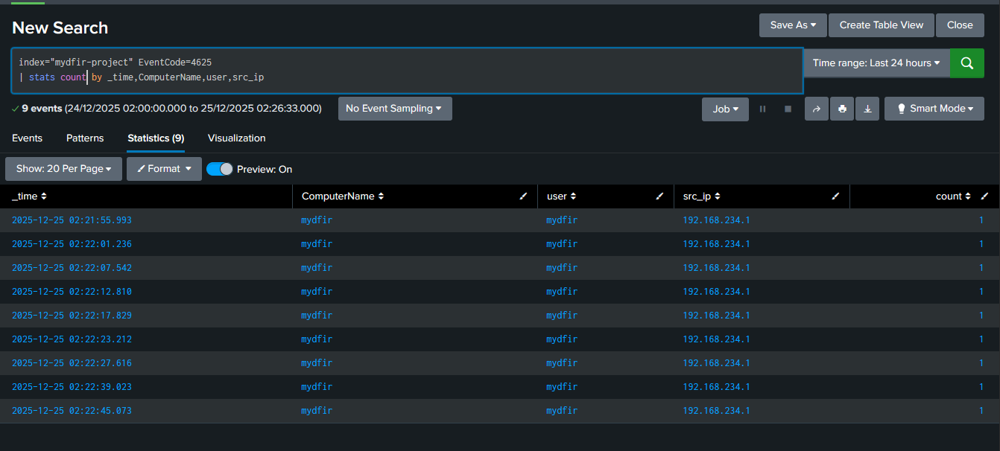
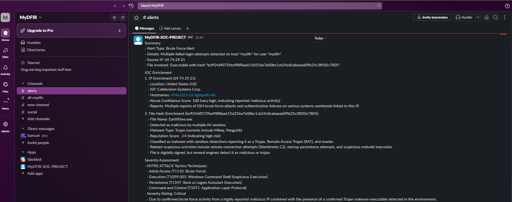

# AI-SOC-Automation
### End-to-End SOC Alert Triage Automation (Splunk · N8N · GPT-4)
[](https://www.splunk.com/) [](https://www.python.org/) [](https://openai.com/) [](https://n8n.io/) [](https://www.docker.com/) [](https://www.virustotal.com/) [](https://slack.com/)

This project demonstrates a production-quality SOC automation designed to accelerate alert triage while maintaining consistency and quality. The system simulates a complete SOC workflow from detection through AI-assisted analysis to case management using industry standard tools and realistic attack scenarios.

---

## 🎯 Project Objective

Modern Security Operations Centers are often overwhelmed by "alert fatigue." This project provides a blueprint for:

* **Accelerating Triage:** Reducing time-to-analysis from minutes to seconds.
* **Ensuring Consistency:** Standardizing investigation quality regardless of analyst experience.
* **AI Augmentation:** Using LLMs as a "force multiplier" for structured analysis and MITRE mapping.
* **Context Preservation:** Maintaining a complete audit trail from initial telemetry to final case creation.

---

## 🛠️ Technology Stack

| Component           | Technology            | Purpose                                          |
| ------------------- | --------------------- | ------------------------------------------------ |
| **SIEM**            | Splunk Enterprise     | Event correlation and alerting                   |
| **Telemetry**       | Sysmon                | Windows endpoint monitoring & process logging    |
| **Orchestration**   | N8N                   | Workflow automation engine (Self-hosted)         |
| **AI Analysis**     | OpenAI GPT-4 mini     | Structured triage generation & technique mapping |
| **Threat Intel**    | VirusTotal, AbuseIPDB | File/IP reputation and risk scoring              |
| **Case Management** | DFIR-Iris             | Investigation lifecycle and evidence tracking    |
| **Notification**    | Slack Webhooks        | Real-time analyst alerting                       |
| **Testing**         | Atomic Red Team       | Adversary emulation (T1059.001, T1027, etc.)     |

---

## 🔄 End-to-End Workflow

1. **Detection:** Splunk generates security alerts from a Windows 10 lab environment based on Sysmon telemetry.
2. **Orchestration:** N8N receives the Splunk webhook and triggers a parallel-processed workflow.
3. **Enrichment:** Simultaneous API queries to **VirusTotal** (file hashes) and **AbuseIPDB** (IP reputation).
4. **AI Analysis:** OpenAI GPT-4 processes the alert + enrichment data to generate a structured report including MITRE ATT&CK mapping and severity assessment.
5. **Case Management:** **DFIR-Iris** automatically creates an investigation case with the full enrichment context.
6. **Notification:** **Slack** delivers a real-time summary to analysts with a direct link to the DFIR-Iris case.

---

## 📸 Visual Screenshots

**1. Splunk Detection**

*Custom Splunk correlation search detecting failed Windows logon attempts (Event ID 4625).*

**2. N8N Workflow**

*End-to-end orchestration from alert ingestion to case creation.*

**3. VirusTotal Enrichment**

*File/IP reputation integrated into AI triage workflow.*

**4. AI-Assisted Triage**

*Structured AI-generated triage report with MITRE ATT&CK mapping.*

**5. DFIR-Iris Case Management**

*Automatically created investigation case with full context.*

**6. Slack Notification**

*Real-time analyst notification with triage summary and direct case link.*

---

## 👤 Individual Contribution

I designed and implemented this system from the ground up, focusing on the following domains:

* **Detection Engineering:** Authored custom Splunk correlation searches targeting malicious PowerShell patterns and remote file downloads.
* **Workflow Orchestration:** Built N8N automation logic with parallel execution branches and custom error recovery mechanisms.
* **Threat Intelligence Integration:** Implemented API connections with logic for rate limiting and data normalization.
* **AI Engineering:** Designed system prompts for structured JSON output and built validation scripts to ensure model reliability.
* **DevOps & Testing:** Containerized the stack using Docker Compose and validated the pipeline using **Atomic Red Team** emulation.

---

## 💡 Lessons Learned & Challenges

#### **Challenge: AI Output Reliability**

**Problem:** Raw LLM outputs can be "chatty" or fail to follow JSON schemas, breaking downstream automation (Slack/Iris).
**Solution:** Implemented a multi-layer validation script (`json_validator.py`) that checks for required fields and cross-references suggested MITRE techniques against a known valid list.

#### **Challenge: Webhook & API Resilience**

**Problem:** High-volume alerts or API downtime can cause data loss or duplicate case creation.
**Solution:** Designed **idempotency controls** to prevent duplicate cases for the same alert and added a **webhook recovery workflow** to retry failed deliveries.

#### **Challenge: Operational Observability**

**Problem:** Identifying where a failure occurred in a multi-step pipeline is difficult without logging.
**Solution:** Implemented logging at every workflow stage, allowing for performance monitoring and quick debugging of failed API calls.

---

## ⚡ Technical Highlights

* **Production Reliability:** Features multi-layer AI output validation and retry logic.
* **Cost Optimization:** Implemented response caching and token-efficient prompting to reduce API costs.
* **Adversary Emulation:** Validated against real-world TTPs (Encoded PowerShell, Download Cradles).
* **No-Code/Low-Code Hybrid:** Demonstrates how to extend N8N with custom Python scripts for advanced logic.

---

## 📁 Repository Structure

```text
ai-soc-automation-pipeline/
├── workflows/         # N8N automation (JSON exports)
├── detections/        # Splunk correlation searches (.spl)
├── scripts/           # Python validators & rate limiters
├── investigations/    # Example case exports from DFIR-Iris
├── docs/              # Deployment & troubleshooting guides
├── screenshots/       # Visual walkthroughs
└── docker-compose.yml # Full lab environment orchestration
```

---

## 🚀 Quick Start

1. **Clone the Repo:**
   `git clone https://github.com/yourusername/ai-soc-automation.git`
2. **Configure Environment:**
   `cp .env.example .env` (Add your VirusTotal, AbuseIPDB, and OpenAI keys).
3. **Spin up Stack:**
   `docker-compose up -d`
4. **Initialize:** Import Splunk detections and N8N workflows found in the `/workflows` and `/detections` folders.
5. **Test:** Execute an Atomic Red Team test on a Windows host.

---


