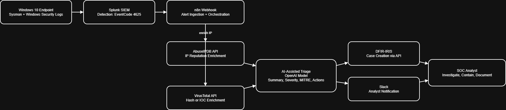

# Architecture

This document describes the end-to-end SOC automation architecture implemented in this repository.

## Diagram

## End-to-End Flow

1. **Windows Endpoint Telemetry**
   - Windows Security Logs and Sysmon generate authentication and process telemetry.

2. **Detection (Splunk SIEM)**
   - Splunk correlation search detects suspicious authentication activity (EventCode 4625).
   - On trigger, Splunk forwards an alert to n8n via webhook.

3. **Orchestration (n8n)**
   - n8n ingests the alert payload and controls workflow execution.
   - Workflow stages are separated to support retries, validation, and troubleshooting.

4. **Threat Intelligence Enrichment**
   - **AbuseIPDB** enriches source IP reputation.
   - **VirusTotal** enriches file hash or IOC reputation.
   - Enrichment outputs are added back into the alert context.

5. **AI-Assisted Triage**
   - The OpenAI model generates a structured triage report including:
     - Summary
     - Severity and rationale
     - MITRE ATT&CK mapping
     - Recommended next actions
   - Output is validated before any downstream actions.

6. **Case Management (DFIR-IRIS)**
   - A DFIR-IRIS case is created automatically with alert context, enrichment, and triage output.

7. **Notification (Slack)**
   - A concise triage summary is posted to Slack for analyst awareness and response.

## Repo Mapping

- Splunk detections: `detections/`
- n8n workflow exports: `workflows/`
- Validation and helper scripts (optional): `scripts/`
- Investigation write-ups: `investigations/`
- Screenshots used in the walkthrough: `screenshots/`

## Design Notes

- AI is used for analyst support, not automated decision making.
- Credentials are stored in environment variables and are not committed to the repository.
- Workflow steps are designed to be independently testable and observable.
